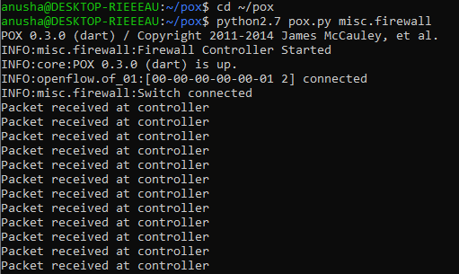
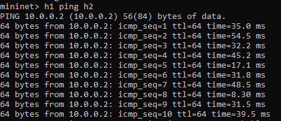
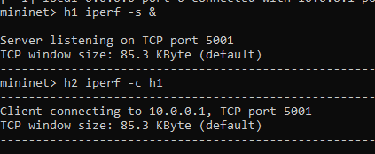
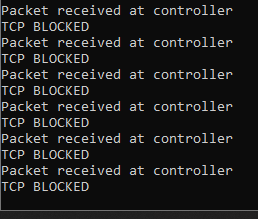

# Topology Change Detection using POX Controller and Mininet

## Objective
The objective of this project is to implement a topology change detection system using Software Defined Networking (SDN) with the POX controller and Mininet. The system aims to monitor network events such as switch connections and packet arrivals, detect changes in the network topology dynamically, and demonstrate how the controller can respond to these changes using OpenFlow rules.

## Tools Used
- Mininet
- POX Controller
- OpenFlow Protocol

## Features
- PacketIn handling
- Match-Action logic
- TCP traffic blocking
- ICMP (ping) allowed

## Topology
Single switch topology with 2 hosts (h1, h2)

## How to Run

### Step 1: Run Controller
python2.7 pox.py misc.firewall

### Step 2: Run Mininet
sudo mn --controller=remote,ip=127.0.0.1 --switch ovs,protocols=OpenFlow10

### Step 3: Test

Ping (Allowed):
h1 ping h2

TCP (Blocked):
h1 iperf -s &
h2 iperf -c h1

## Output
- Packet received at controller
- TCP BLOCKED

## Conclusion
Successfully implemented SDN firewall using POX controller with match-action rules.

## Output Screenshots

### Controller Output

### Ping Test

### TCP Test (iperf start)

### TCP Blocking Result

